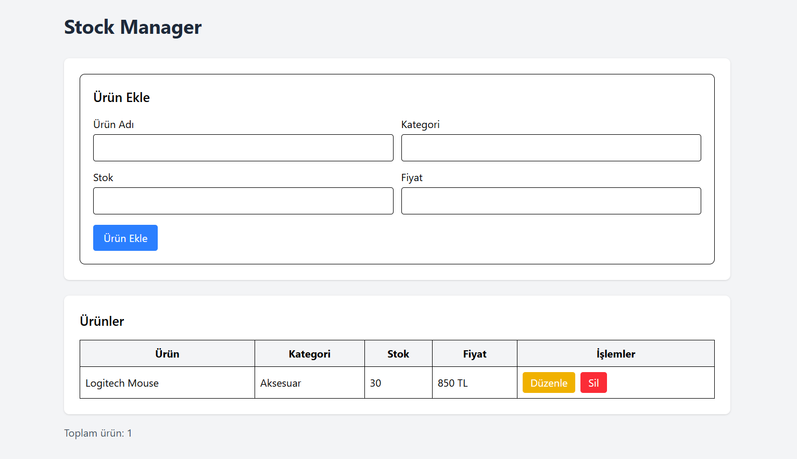

# 📦 StockManager

> React ve JavaScript kullanılarak geliştirilmiş basit bir stok takip uygulaması.

StockManager, ürünlerin stok bilgilerinin **eklenmesi, listelenmesi, güncellenmesi ve silinmesi** işlemlerini gerçekleştiren bir frontend web uygulamasıdır.

Bu proje, modern JavaScript ve React kullanarak temel frontend geliştirme prensiplerini uygulamak amacıyla geliştirilmiştir.

---

## ✨ Özellikler

* ➕ Yeni ürün ekleme
* 📋 Ürünleri listeleme
* ✏️ Ürün bilgilerini güncelleme
* 🗑️ Ürün silme
* 💾 LocalStorage ile verileri saklama
* 📱 Responsive kullanıcı arayüzü

---

## 🛠️ Kullanılan Teknolojiler

| Teknoloji    | Kullanım                |
| ------------ | ----------------------- |
| JavaScript   | Uygulama geliştirme     |
| React        | Kullanıcı arayüzü       |
| Vite         | Proje geliştirme ortamı |
| Tailwind CSS | Arayüz tasarımı         |
| LocalStorage | Veri saklama            |
| ESLint       | Kod kontrolü            |
| Git          | Versiyon kontrolü       |
| GitHub       | Proje yönetimi          |

---

## 📦 Ürün Bilgileri

Her ürün aşağıdaki bilgilerden oluşmaktadır:

```text
Ürün Adı
Kategori
Stok
Fiyat
```

Örnek:

```text
Ürün Adı : Logitech Mouse
Kategori : Aksesuar
Stok     : 20
Fiyat    : 850 TL
```

---

## 📁 Proje Yapısı

```text
stock-manager/
│
├── public/
│
├── src/
│   │
│   ├── components/
│   │   ├── ProductForm.jsx
│   │   └── ProductList.jsx
│   │
│   ├── pages/
│   │   └── StockManager.jsx
│   │
│   ├── interfaces/
│   │   └── product.js
│   │
│   ├── App.jsx
│   ├── index.css
│   └── main.jsx
│
├── .gitignore
├── package.json
├── package-lock.json
├── vite.config.js
└── README.md
```

---

## 🚀 Kurulum

Projeyi bilgisayarınıza klonladıktan sonra proje klasörüne gidin:

```bash
cd stock-manager
```

Gerekli paketleri yükleyin:

```bash
npm install
```

---

## ▶️ Projeyi Çalıştırma

Geliştirme sunucusunu başlatmak için:

```bash
npm run dev
```

Ardından terminalde gösterilen localhost adresinden uygulamaya erişebilirsiniz.


---

## 🏗️ Production Build

Production sürümünü oluşturmak için:

```bash
npm run build
```

---

## 🌐 Canlı Demo

> Netlify deployment tamamlandıktan sonra canlı proje bağlantısı buraya eklenecektir.

**Live Demo:** `Yakında`

---

<h2 align="center">📸 Proje Görüntüsü</h2>

<p align="center">
  
</p>

---

## 🔗 GitHub

Kaynak kodlarına GitHub repository üzerinden ulaşabilirsiniz:

**[StockManager - GitHub](https://github.com/barismutluu/stock-manager)**

---

## 🎯 Projenin Amacı

Bu proje kapsamında modern JavaScript ve React kullanılarak temel bir frontend uygulamasının geliştirilmesi amaçlanmıştır.

Proje içerisinde temel **CRUD (Create, Read, Update, Delete)** işlemleri uygulanmış ve ürün bilgilerinin tarayıcı üzerinde saklanması için **LocalStorage** kullanılmıştır.

Ayrıca React component yapısı, proje klasörleme, Tailwind CSS, Git ve GitHub kullanımı uygulanmıştır.

---

### 👨‍💻 Geliştirici

**Barış Mutlu**

